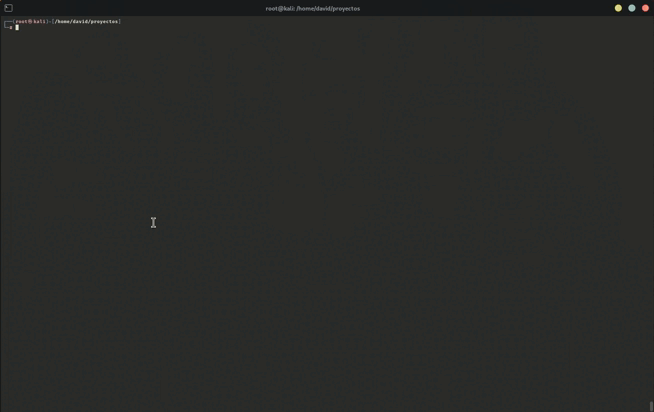

<h1>MITM -  man in the middle </h1>
<p>
  NEXUS es una herramienta avanzada desarrollada en Python orientada a tareas de intercepción de tráfico en redes LAN mediante ataques MITM (Man-In-The-Middle). Esta utilidad está especialmente diseñada para profesionales de la ciberseguridad, analistas de redes y entusiastas del pentesting ético que deseen observar y analizar tráfico de red en tiempo real.
NEXUS permite realizar spoofing ARP, capturar paquetes DNS/HTTP, visualizar imágenes transmitidas por HTTP, e incluso exportar la información capturada en formato .pcap o Excel. Con su interfaz opcional basada en Tkinter y soporte para salida colorida en terminal, la herramienta no solo es funcional sino también visualmente amigable. Su arquitectura flexible permite definir objetivos manualmente o mediante archivo, adaptándose a escenarios reales de análisis de tráfico.
</p>

# DEMO
<br>



# INSTALL

```
git clone https://github.com/Dracos22/MITM.git

```


```
python nexus.py --help

```


```
 python nexus.py --help
usage: nexus.py [-h] [--ifaces] [-i INTERFACE] [-t VICTIMA GATEWAY] [-l LIST_TARGETS] [-f FORMAT] [-I] [--gui] [-o OUTPUT] [-p PCAP] [--dns-spoof] [--http-spoof] [--sslstrip]
                [--set-colors {negro,rojo,verde,amarillo,azul,magenta,cyan,blanco,naranja,rosa,lila,oliva,marrón,aqua,plata,dorado,rojo_oscuro,verde_oscuro,azul_oscuro}]

NEXUS - MITM Sniffing and Spoofing Tool

options:
  -h, --help            show this help message and exit
  --ifaces              Listar interfaces de red disponibles
  -i, --interface INTERFACE
                        Interfaz de red a utilizar (requerido)
  -t, --target VICTIMA GATEWAY
                        Par de direcciones IP: víctima y gateway
  -l, --list-targets LIST_TARGETS
                        Archivo de texto con IPs objetivo (una por línea)
  -f, --format FORMAT   Guardar salida en formato Excel (.xlsx, .xls, .xml, etc.)
  -I, --img             Capturar imágenes desde tráfico HTTP
  --gui                 Mostrar imágenes capturadas en una ventana gráfica
  -o, --output OUTPUT   Directorio de salida para guardar archivos capturados
  -p, --pcap PCAP       Nombre del archivo .pcap para guardar tráfico capturado
  --dns-spoof           Activar spoofing DNS
  --http-spoof          Activar spoofing HTTP
  --sslstrip            Activar SSLstrip (requiere iptables y redirección de puertos)
  --set-colors {negro,rojo,verde,amarillo,azul,magenta,cyan,blanco,naranja,rosa,lila,oliva,marrón,aqua,plata,dorado,rojo_oscuro,verde_oscuro,azul_oscuro}
                        Color para los valores entre [ ] en la salida

```


📘 Parámetros de uso (CLI) — nexus.py
<ul>
  <li> <strong>-i, --interface:</strong> Especifica la interfaz de red a usar (requerido).</li>
  <li> <strong>-t, --target:</strong> Define el par IP víctima y gateway para el spoofing ARP. Ej: -t 192.168.0.105 192.168.0.1</li>
  <li> <strong>-l, --list-targets:</strong> Permite cargar un archivo .txt con una lista de IPs víctimas. Se requiere que -t defina el gateway.</li>
  <li> <strong>--dns-spoof:</strong> Activa la detección y visualización de peticiones DNS interceptadas.</li>
  <li> <strong>--http-spoof:</strong> Activa la detección de tráfico HTTP, mostrando dominios, rutas y resolución IP.</li>
  <li> <strong>--set-colors:</strong> 	Aplica color a los valores entre corchetes [ ] en la salida. Colores soportados: verde, amarillo, azul, naranja, lila, rosa, marrón, oliva, plata, etc.</li>
  <li> <strong>--sslstrip:</strong> Activa redirección de tráfico HTTPS a HTTP (requiere iptables).</li>
  <li> <strong>-I, --img:</strong> Habilita la detección y extracción de imágenes transmitidas en HTTP.</li>
  <li> <strong>--gui:</strong> Activa una ventana GUI para mostrar las imágenes capturadas (Tkinter).</li>
  <li> <strong>-p, --pcap:</strong> Guarda el tráfico capturado en un archivo .pcap. Puede combinarse con -o.</li>
  <li> <strong>-f, --format:</strong> Exporta los resultados (DNS y HTTP) en un archivo Excel (.xlsx, .xls, .xml, etc).</li>
  <li> <strong>-o, --output:</strong> Directorio de salida para los archivos .pcap o Excel. Ej: -o /home/usuario/Escritorio.</li>
  <li> <strong>--ifaces:</strong> Muestra una lista de interfaces de red disponibles y luego sale.</li>
  <li> <strong>-h, --help:</strong> Muestra este mensaje de ayuda y finaliza.</li>
</ul>


# EXAMPLE
<p>
  El siguientes comando nos muestra las interfaces que tenemos disponibles.
</p>


```
  python nexus.py --iface
```


```
python nexus.py --ifaces
Interfaces disponibles:
 - lo
 - eth0
 - eth1
 - wlan0
 - docker0
```

```
python nexus.py -i eth1 -t [ IP-VICTIMA ] [ PUERTA DE ENLACE ] --http-spoof --sslstrip --dns-spoof --set-colors=amarillo   -o /ruta/ -f capture.xlsx

```

